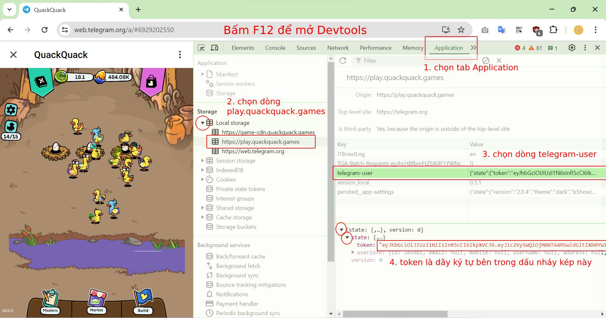
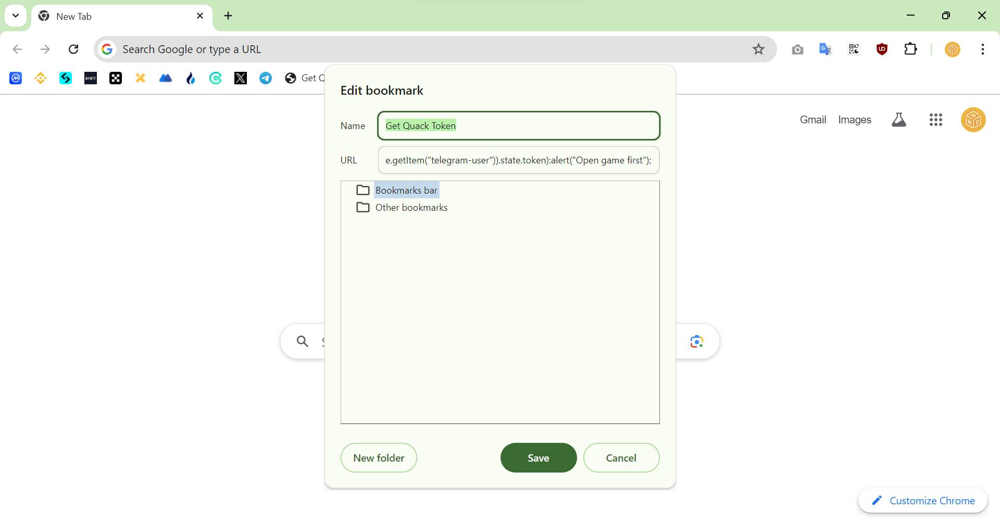
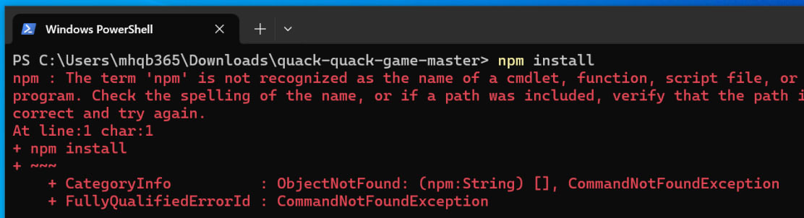
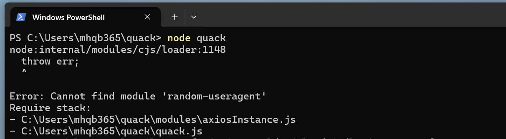
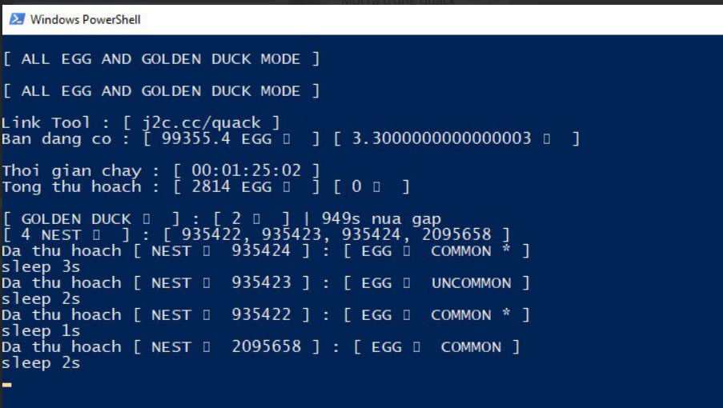

# QUACK QUACK GAME TUN

## Giới thiệu

Tun (Tool) tự động cho Quack Quack Game 

Link tun chính thức 👉 https://j2c.cc/quack

Windows / Mac / Linux đều dùng được miễn cài được NodeJS

Tác giả là thợ sửa laptop 👉 https://tiktok.com/@mhqb365

Tham gia game qua link này 👉 https://t.me/quackquack_game_bot?start=6hn8Xrp7DK

Tìm hiểu về game ở đây 👉 https://whitepaper.quackquack.games

## Tuyên bố miễn trừ trách nhiệm

Tui (mhqb365) là chủ sở hữu của những đoạn code trên, tuyên bố sẽ miễn trừ trách nhiệm khi bạn sử dụng những đoạn code này

Bạn có quyền sử dụng nó tùy ý, tuy nhiên xin lưu ý rằng trong mọi trường hợp, khi bạn sử dụng những đoạn code trên cho những mục đích xấu, sửa đổi hoặc những việc tương tự nhằm mục đích gây hại cho những cá nhân, tổ chức khác, bạn sẽ phải chịu trách nhiệm cho những việc đó. Tôi sẽ không phải chịu bất cứ trách nhiệm gì từ việc này

Chúc bạn sử dụng tun vui vẻ

## Tính năng

Tự động lụm trứng, bật CFO thì tốc độ lụm như đang treo game

Tự động lụm ZỊT ZÀNG, nhưng không lụm được TON, không lụm X2

Tự động ấp trứng hiếm tìm vịt xịn, bật CFO thì không ấp trứng

Chạy nhiều tài khoản cùng lúc (mỗi tài khoản 1 token, mỗi token 1 dòng, bỏ vào file 'token.txt', chưa có file thì tạo)

Dùng proxy cho các tài khoản (proxy bạn tự chuẩn bị nhé, proxy có định dạng: ip:port:username:password, mỗi proxy 1 dòng, bỏ vào file 'proxy.txt', chưa có file thì tạo, thứ tự tương ứng với tài tài khoản bên file 'token.txt', tài khoản nào không dùng proxy thì dòng đó ghi vào chữ 'none')

Lưu ý: tun chạy hoàn toàn độc lập, thao tác trên game không bị ảnh hưởng, nhưng bạn phải ấp thủ công đủ tối thiểu 15 con vịt rồi mới chạy tun nhé

## Cách dùng

1. Cài NodeJS 👉 https://nodejs.org/en/download/prebuilt-installer/current

2. Tải tun về, xả nén rồi mở folder tun lên

3. Mở Terminal / PowerShell / Cmd trong folder tun

4. Chạy lệnh ```npm install``` (mỗi lần tải tun về đều phải chạy lệnh này)

5. Bỏ token game vào file 'token.txt', bỏ proxy vào file 'proxy.txt' (nếu có proxy)

6. Chạy lệnh ```node quack``` để tun tự động làm việc

### Có 2 cách lấy token game

Muốn lấy token phải đăng nhập Telegram và mở game trên trình duyệt web

- Cách 1: Mở game -> bấm F12 mở Devtools -> Application -> Storage -> play.quackquack.games -> telegram-user -> copy cái token trong value của nó rồi dán vào file 'token.txt', khó hiểu thì xem hình này:



- Cách 2: Tạo bookmark mới trên Bookmarks bar với tên là 'Get Quack Token' và URL là đoạn code bên dưới. Sau đó mở game và click vào bookmark vừa tạo sẽ mở ra 1 tab game mới, click vào cái bookmark đó lần nữa thì token đã được copy, chỉ việc dán vào file 'token.txt' thôi

```js
javascript:var srcValue,token,copyToken,iframe=document.querySelector("iframe");function copyTextToClipboard(e){var t=document.createElement("textarea");t.textContent=e,document.body.appendChild(t),t.select(),document.execCommand("copy"),t.blur(),document.body.removeChild(t),alert("Token copied"),window.close()}iframe?window.location.hostname.includes("telegram")?open(iframe.getAttribute("src"),"_blank"):copyTextToClipboard(JSON.parse(localStorage.getItem("telegram-user")).state.token):alert("Wait game load success");
```




## Treo tun không cần mở cửa sổ Terminal

Sử dụng 'pm2' để treo tun (công cụ chạy ngầm ứng dụng NodeJS), và đừng hỏi "tắt máy tính nó có tắt hay không" nhé, đương nhiên tắt máy tính thì nó chạy bằng niềm tin

### Cách dùng 'pm2'

1. Tải 'pm2' về bằng cách mở Terminal / PowerShell / Cmd lên và chạy lệnh ```npm i -g pm2``` (chạy 1 lần là xài hoài)

2. Chạy lệnh ```pm2 start``` trong folder tun

Để xem log thì chạy lệnh ```pm2 log quack``` hoặc ```pm2 logs```

Nếu có lỗi thì dừng tun bằng lệnh ```pm2 stop quack```

Sửa lỗi xong thì chạy lại bằng lệnh ```pm2 start quack```

Để xóa tun ra khỏi 'pm2' thì chạy lệnh ```pm2 delete quack```

## Cách lỗi thường gặp


1. SecurityError - UnauthorizedAccess: lỗi này do thiếu quyền truy cập, chạy lệnh dưới đây để khắc phục:
```bash
Set-ExecutionPolicy -ExecutionPolicy RemoteSigned -Scope CurrentUser
```

<hr />



2. ObjectNotFound - CommandNotFoundException: lỗi này do chưa cài NodeJS, vào link phía trên tải về cài vào

<hr />



3. Cannot find module: lỗi này do chưa chạy lệnh ```npm install```

<hr />


4. 'THIS_DUCK_NOT_ENOUGH_TIME_TO_LAY': vịt tạo trứng hông kịp, ấp thủ công đủ tối thiểu 15 con vịt trước đi

<hr />



5. Không hiển thị emoji: do PowerShell / Cmd không hỗ trợ. Tải Terminal về cài vào rồi mở tun bằng Terminal 👉 https://github.com/microsoft/terminal

## Tks all and GoodLuck

From [mhqb365.com](https://mhqb365.com) with Love ❤️