# Quack Quack Game Tool

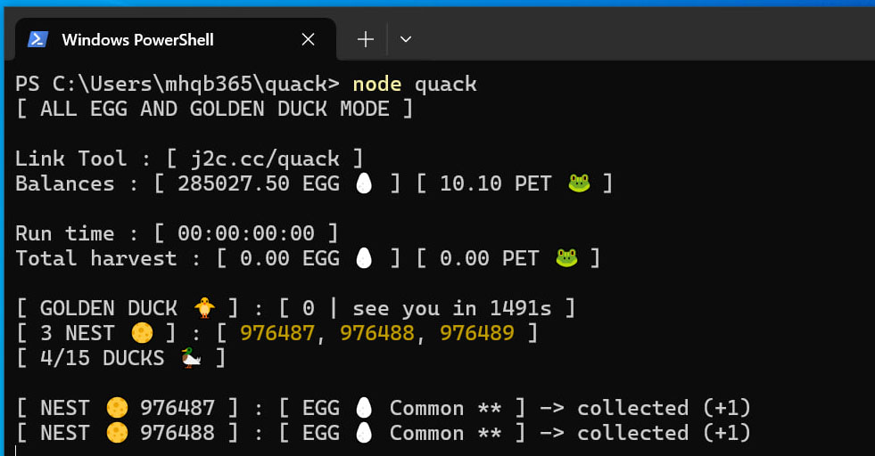

Đây là công cụ tui làm ra chỉ để thử sức cũng như học hỏi thêm về code nên nó rất đơn giản và đôi khi có nhiều lỗi

Vì công việc của tui là sửa laptop chứ không phải làm về code 👉 https://www.tiktok.com/@mhqb365

Windows / Mac / Linux / Android đều dùng được miễn cài được NodeJS 👉 https://nodejs.org/en/download/prebuilt-installer

Mọi người có hứng thú với con game vô tri này thì tham gia ở đây 👉 https://t.me/quackquack_game_bot?start=6hn8Xrp7DK

Link Tool chính thức 👉 https://j2c.cc/quack

## Tuyên bố miễn trừ trách nhiệm

Tui (mhqb365) là chủ sở hữu của những đoạn code trên, tuyên bố sẽ miễn trừ trách nhiệm khi bạn sử dụng những đoạn code này

Bạn có quyền sử dụng nó tùy ý, tuy nhiên xin lưu ý rằng trong mọi trường hợp, khi bạn sử dụng những đoạn code trên cho những mục đích xấu, sửa đổi hoặc những việc tương tự nhằm mục đích gây hại cho những cá nhân, tổ chức khác, bạn sẽ phải chịu trách nhiệm cho những việc đó. Tôi sẽ không phải chịu bất cứ trách nhiệm gì từ việc này

Chúc bạn sử dụng Tool vui vẻ

## Tính năng

Tự động lụm trứng

Tự động lụm ZỊT ZÀNG (cái con bạch tuột mỏ vịt lâu lâu xuất hiện, vì lý do bảo mật nên không lụm được TON nhé)

Tự động ấp trứng hiếm

Có thể tùy chọn chức năng để chạy Tool

Ngẫu nhiên chọn vị trí tổ rơm để lụm hoặc ấp trứng

Ngẫu nhiên thời gian lụm hoặc ấp trứng. Từ 1 đến maxSleepTime trong file ```config.json``` (đơn vị: giây)

Tool chạy hoàn toàn độc lập nhưng sẽ xung đột tính năng lụm & ấp trứng với CFO

Đang cập nhật thêm cái gì đó...

## Tiêu chí ấp trứng

Khi chạy chức năng ấp trứng thì Tool sẽ tự chọn trứng hiếm nhất để ấp. Là loại trứng có rate thấp nhất theo bảng độ hiếm này

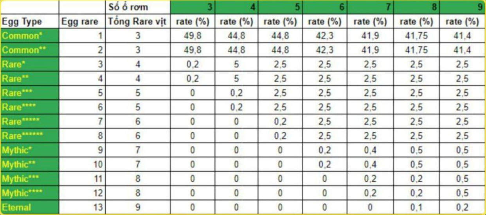

Khi ấp được vịt thì dựa vào các thành phần của vịt để tính điểm


- LEGENDARY : 3 điểm
- RARE : 2 điểm
- COMMON : 1 điểm

Vịt có tổng điểm cao hơn thì xịn hơn

Ví dụ vịt RARE + RARE + RARE sẽ bằng điểm với vịt LEGENDARY + RARE + COMMON

Để ấp được vịt nhiều điểm thì bạn cần có nhiều tổ rơm để tăng tỉ lệ ra trứng hiếm, xem lại bảng độ hiếm

Khi ấp được vịt lỏ thì Tool sẽ tự động xóa luôn

Khi chạy chức năng ấp trứng thì Tool sẽ tự động xóa đi 1 con vịt lỏ nhất để nhường chổ khi FARM đầy

Tool sẽ tự động tắt tính năng ấp trứng khi FARM vịt max điểm

Nói chung cái tính năng ấp trứng này là hoàn toàn tự động, tiêu chí là tạo FARM toàn vịt xịn

## Cách dùng

Máy tính cần hiện đuôi file để thao tác dễ hơn (hiện đuôi file trên Windows bằng cách mở Start menu -> tìm File Explorer Options -> View -> bỏ tick Hide extentions for known file types -> OK)

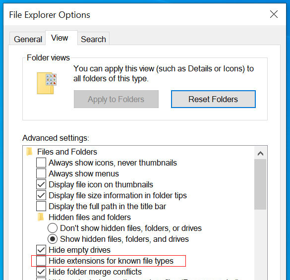

Cài NodeJS chưa? Chưa thì kéo lên trên lấy link tải về cài vào (cài một lần duy nhất là xài luôn)

Tải Tool về, thấy cái nút (<> Code) màu xanh lá ở trên hem? Click vào đó để Download ZIP về, giải nén rồi mở thư mục vừa giải nén

Đăng nhập Telegram trên trình duyệt web (Chrome, Edge, v.v..)

Dùng tổ hợp phím Ctrl + Shift + B để thanh Bookmarks bar luôn luôn hiển thị

Chuột phải vào Bookmars bar -> tạo Bookmark mới với Name là ```Get Quack Token``` và URL là đoạn code này

```js
javascript:var srcValue,token,copyToken,iframe=document.querySelector("iframe");iframe?window.location.hostname.includes("telegram")?open(iframe.getAttribute("src"),"_blank"):prompt("Copy this game Token",JSON.parse(localStorage.getItem("telegram-user")).state.token)&&window.close():alert("Open game first");
```

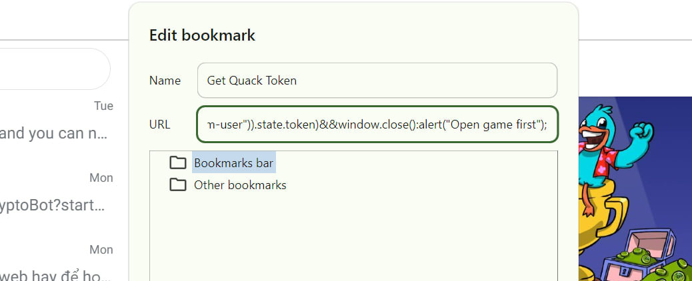

Sau đó mở game lên và click vào cái Bookmark vừa tạo, một tab game mới sẽ được mở lên. Lúc này bạn click vào cái Bookmark phát nữa thì Token sẽ hiện lên và copy nó. Bấm OK thì tab game mới sẽ tự tắt đi

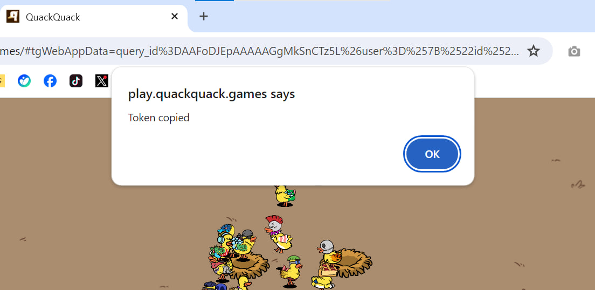

Paste Token vừa copy vào file ```token.txt``` rồi lưu lại, nếu chưa có file thì tạo file mới (chuột phải -> New -> Text Document -> token.txt)

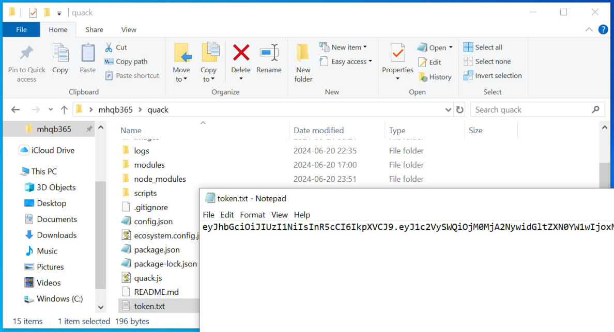

Chưa hiểu thì xem cách lấy Token ở đây 👉 https://vt.tiktok.com/ZSYPGvXFh/

Cài đặt Tool ở file ```config.json```, giữ nguyên hoặc xem chú thích bên dưới để tùy chỉnh

```json
{
  "nest": 3, // số tổ rơm bạn đang có, nếu có nhiều hơn thì thay số vào
  "maxSleepTime": 3, // thời gian nghỉ tối đa giữa mỗi lần lụm trứng, đơn vị: giây
  "retryCount": 86400, // số lần thử lại khi mất kết nối, quá số lần sẽ dừng Tool
}
```

Mở Terminal / PowerShell / Cmd trong thư mục Tool (trên Windows thì đè Shift + chuột phải > Open PowerShell window here)

Nhập vào Terminal dòng code ```npm install``` để cài đặt các thư viện cần thiết

Muốn chạy chức năng nào thì chọn dòng code tương ứng bên dưới nhập vào Terminal

| Code | Chức năng |
|---|---|
| ```node quack``` | lụm tất cả trứng & ZỊT ZÀNG |
| ```node quack 1``` | chỉ lụm ZỊT ZÀNG |
| ```node quack 2``` | lụm trứng lỏ & ấp trứng hiếm & lụm ZỊT ZÀNG |

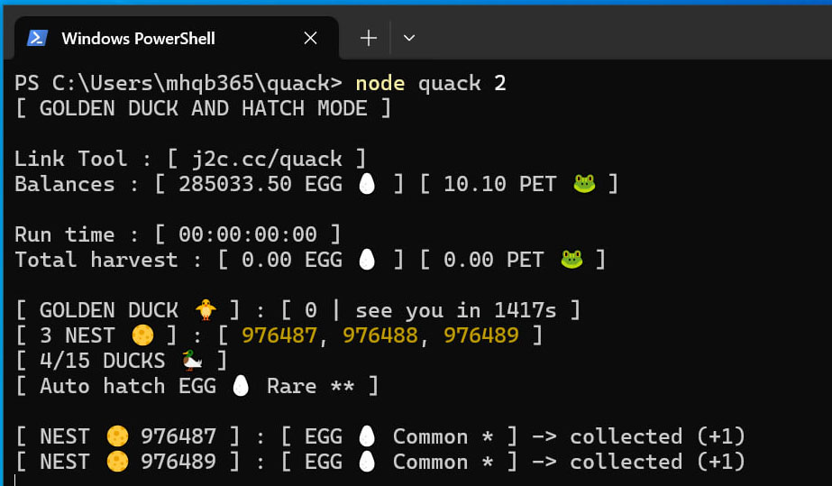

## Chạy Tool không cần treo Terminal

Bạn muốn Tool chạy ngầm? ```pm2``` sẽ giúp bạn làm điều này

Cài ```pm2``` bằng cách nhập vào Terminal dòng code ```npm install -g pm2``` (cài một lần duy nhất là xài luôn)

Chọn tính năng Tool chạy ở tham số ```args``` trong file ```ecosystem.config.js```

| Tham số | Chức năng |
|---|---|
| args: "" | tương ứng với node quack |
| args: "1" | tương ứng với node quack 1 |
| args: "2" | tương ứng với node quack 2 |

Chạy Tool thì nhập vào Terminal dòng code này ```pm2 start```

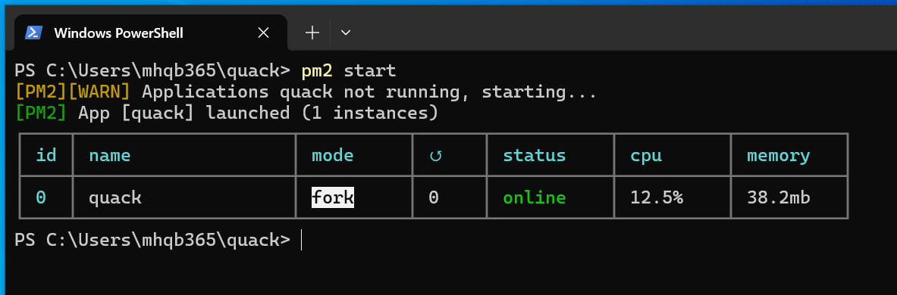

Xem Tool chạy bằng cách nhập vào Terminal dòng code này ```pm2 log quack```

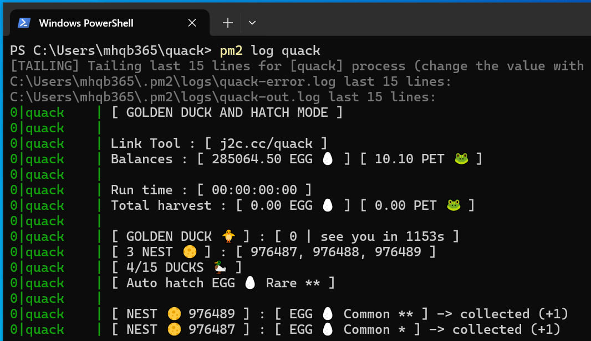

Bấm tổ hợp phím Ctrl + C để thoát xem Tool chạy

Dừng Tool thì nhập vào Terminal dòng code này ```pm2 stop quack```

Mỗi lần chỉnh sửa trong ```ecosystem.config.js``` thì nhớ dừng Tool, sửa xong mới chạy lại

Xem có đang chạy Tool không thì nhập vào lệnh ```pm2 ls```

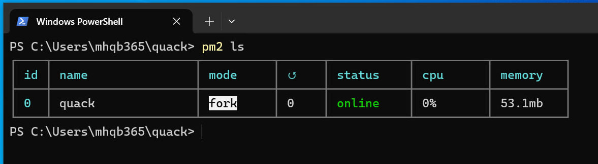

## Phần phụ

Xem lại lịch sử trong thư mục ```logs```

Lịch sử lụm ZỊT ZÀNG ở file ```golden_duck_ngày_tháng_năm.txt```

Lịch sử ấp trứng ở file ```farm_ngày_tháng_năm.txt```

Lịch sử lỗi ở file ```error_ngày_tháng_năm.txt```

Lịch sử khác ở file ```log_ngày_tháng_năm.txt```

## Các lỗi thường gặp

### SecurityError - UnauthorizedAccess

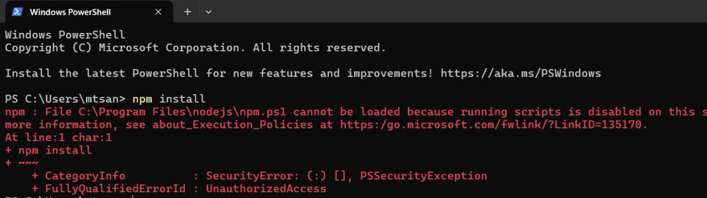

Gặp lỗi trên chỉ cần dán dòng lệnh dưới đây vào rồi enter là được

```bash
Set-ExecutionPolicy -ExecutionPolicy RemoteSigned -Scope CurrentUser
```

### ObjectNotFound - CommandNotFoundException


Gặp lỗi này thì dùm ơn, kéo lên trên đọc kỹ lại từ đầu 🤦‍♂️ đã cài NodeJS đâu mà chẳng gặp lỗi này

### Lặp lại nhiều lần THIS_DUCK_NOT_ENOUGH_TIME_TO_LAY


Lỗi này do vịt không đẻ kịp. Tự ấp thủ công thêm vịt để tránh lỗi này (vịt lỏ cũng được, tối thiểu 10 con)

### Không hiển thị emoji


Cái này là do PowerShell / Cmd không hỗ trợ. Tải Terminal về cài vào rồi mở Tool bằng Terminal 👉 https://github.com/microsoft/terminal
